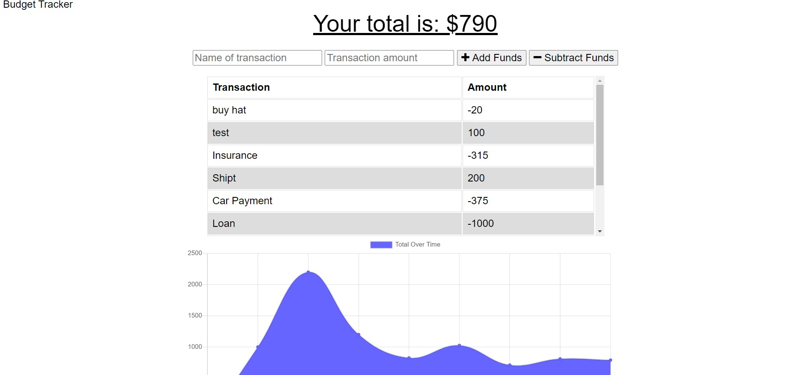

# Budget Tracker 

## Purpose

To create an application to keep track of finances throught withdrawals and deposits with or without an internet connection

## Features 

When the application is open the users account balance is shown.  They can enter a transaction that will either add  to or subtract from the account.  Once a transaction is processed a graph shows the balance history.  If there is no internet conection a transaction can still be completed and will be stored to process once an internet connection is reestablished.

## Technology

* React JS
* Express JS
* Mongo DB
* Indexed DB
* Node JS
* Javascript
* XML
* HTML
* CSS

## Usage
To use locally save files run npm install and npm start.

## Application URL
Navigate to (url)

## Project status
The budget tracker is compliant with defined acceptance criteria

## Contribution
Created by Neil Dino

